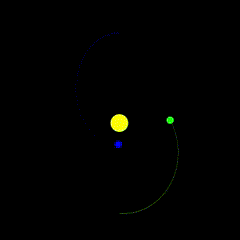

# Simple Gravity Simulator

This C++ application simulates the gravitational interaction between N bodies in a 2D space. The user can configure the initial scenario to be simulated via a JSON configuration file.

# Configuration

In the *config.json* file the user can specify the bodies for the given scenario, by selecting their:
- Initial position (x,y) (where the origin 0,0 is the bottom-left corner of the GUI)
- Initial velocity (x,y)
- Mass (kg)
- Radius (px) (used just for UI purposes)
- Color (r,g,b)

# Dependencies
- OpenGL/GLUT
- nlohmann/json